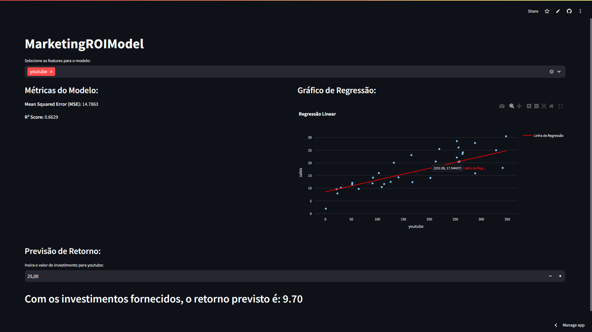

# MarketingROIModel

## Descrição do Projeto

 Análise e predição do retorno sobre investimentos em publicidade online, utilizando técnicas de ciência de dados para entender a relação entre gastos e geração de leads


Uma empresa está investindo mensalmente em plataformas de publicidade online, como Youtube, Facebook e newspaper, para a prospecção de leads (pessoas interessadas em seus produtos). A fim de acompanhar o desempenho desses investimentos, a empresa registra todos os gastos com publicidade e todos os retornos de vendas gerados a partir desses investimentos.

Para **entender** melhor **a relação entre as variáveis** presentes nesses registros e **identificar os fatores que mais impactam** na geração de leads, a empresa solicitou a análise de um especialista em dados. **Além disso, a empresa busca criar um modelo de predição** de valores para estimar o retorno de vendas que pode ser gerado a partir de um determinado investimento em publicidade.

## Objetivo
Identificar os fatores que mais impactam nas vendas e prever o ROI para:
- Auxiliar na otimização de investimentos em marketing.
- Gerar insights para estratégias de alocação de recursos.
- Melhorar a previsão de resultados de campanhas futuras.

## Sobre os dados

A tabela contém informações dos investimentos feitos pelo youtube, facebook, newspaper e também a quantidade de cada.

| **Coluna**   | **Descrição**                           |
|--------------|-----------------------------------------|
| `youtube`    | Investimento em publicidade no YouTube. |
| `facebook`   | Investimento em publicidade no Facebook.|
| `newspaper`  | Investimento em publicidade em jornais. |
| `sales`      | Valor das vendas gerado .               |

## Metodologia
O projeto seguiu as etapas abaixo:

### 1. **Exploração e Limpeza de Dados**
- Análise exploratória para entender distribuições, identificar outliers e verificar correlações.
- Verificação e tratamento de valores duplicados e ausentes.

### 2. **Modelagem**
- Implementação de um modelo de Regressão Linear para prever as vendas com base nos investimentos.
- Divisão dos dados em conjuntos de treino e teste.

### 3. **Avaliação do Modelo**
- Cálculo das métricas:
  - **MAE (Erro Absoluto Médio)**
  - **MSE (Erro Quadrático Médio)**
  - **RMSE (Raiz do Erro Quadrático Médio)**
  - **R² (Coeficiente de Determinação)**

### 4. **Visualização**
- Gráficos interativos de regressão linear para explorar as relações entre investimentos e vendas.
- Representações visuais das previsões e métricas do modelo.

### 5. **Previsões Interativas**
- Ferramenta para simular o retorno esperado com base em diferentes valores de investimento.

## Ferramentas e Tecnologias
- **Linguagem**: Python
- **Bibliotecas Principais**:
  - `pandas`, `numpy`: Manipulação e análise de dados.
  - `matplotlib`, `seaborn`, `plotly`: Visualizações.
  - `scikit-learn`: Modelagem e métricas de avaliação.
  - `streamlit`: Criação da interface interativa.

## Resultados
- Criação em uma aplicação usando o Streamlit para a criação de um modelo interativo.
- Aplicação permite simular o retorno em vendas conforme o investimento em publicidade.

abaixo está a visualização da aplicação Streamlit:



## Como Reproduzir
1. Clone este repositório:
   ```bash
   git clone https://github.com/AurelioGuilherme/MarketingROIModel.git
   ```
2. Instale as dependências listadas no arquivo `requirements.txt`:
   ```bash
   pip install -r requirements.txt
   ```
3. Execute o aplicativo Streamlit:
   ```bash
   streamlit run app.py
   ```
4. Acesse a aplicação diretamente através do link de deploy no Streamlit Cloud: [Marketing ROI Model](https://marketingroimodell.streamlit.app/).

5. (Opcional) Explore o notebook `mkt_model.ipynb` para uma análise detalhada.

## Contribuições
Sugestões e melhorias são bem-vindas! Envie um pull request ou entre em contato através da aba de Issues.